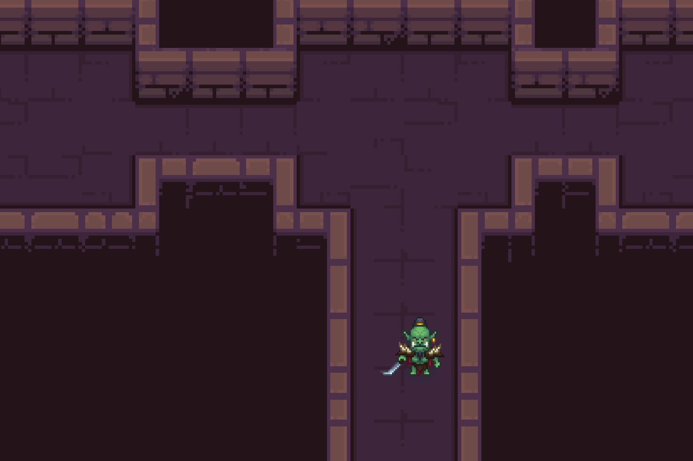

# `roguelike`

[![Build Status][ci-shield]][ci-url]
[![Rust][rust-shield]][rust-url]
[![MIT License][license-shield]][license-url]

Tiny hobby / free-time roguelike game pet-project. 🔮🧝🏻🪄

```
    ____                         __    _ __
   / __ \____  ____ ___  _____  / /   (_) /_____
  / /_/ / __ \/ __ `/ / / / _ \/ /   / / //_/ _ \
 / _, _/ /_/ / /_/ / /_/ /  __/ /___/ / ,< /  __/
/_/ |_|\____/\__, /\__,_/\___/_____/_/_/|_|\___/
            /____/
```

## Screenshot



## Tested Platforms

It might be you will need Vulkan SDK, but this is not certain.

- Arch Linux
- EndeavourOS
- Ubuntu LTS
- MacOS (14.7.1, 15.3)

It doesn't work in WSL and with WSLg at the moment. However, it might work with native MS Windows 11+.

## Roadmap & Future Plans

- [x] Move/migrate from `SDL2` to `wgpu`/`winit`.
- [x] Cleanup a bit `wgpu`/`winit` implementation.
- [x] Github Actions (basic CI/CD).
- [ ] Better configuration management.
- [ ] Update to the Rust 2024 edition.
- [ ] Implement basic level editor (maybe Leptos web-based; doesn't have to be "native").
- [ ] Allow to select the different `wgpu` backends (not just Vulkan, but also OpenGL, etc.).
- [ ] Bump all dependency versions and migrate to new versions (especially `wgpu`/`winit`).
- [ ] Add two more orc types (Orc1 and Orc2; at the moment only Orc3 is supported).
- [ ] Add support and resolve issues with WSL/WSLg.
- [ ] Add support and resolve issues with native MS Windows 11+.
- [ ] Cover with tests what's possible.
- [ ] Music and sound effects.
- [ ] Main menu and options.
- [ ] Add collectibles.
- [ ] Inventory system.
- [ ] Add HP and MP (mana).
- [ ] Try to add some enemies.

## Assets

### `./assets/orc`

Source: [click here](https://craftpix.net/freebies/free-top-down-orc-game-character-pixel-art).

### `./assets/dungeon`

Source: [click here](https://pixel-poem.itch.io/dungeon-assetpuck).

## License (except assets)

[MIT](./LICENSE.md)

[ci-shield]: https://img.shields.io/github/actions/workflow/status/resurtm/roguelike/ci.yml?style=for-the-badge
[ci-url]: https://github.com/resurtm/roguelike/actions/workflows/ci.yml
[rust-shield]: https://img.shields.io/badge/Rust-000000?style=for-the-badge&logo=rust&logoColor=white
[rust-url]: https://www.rust-lang.org/
[license-shield]: https://img.shields.io/github/license/resurtm/roguelike?style=for-the-badge
[license-url]: https://github.com/resurtm/roguelike/blob/main/LICENSE.md
